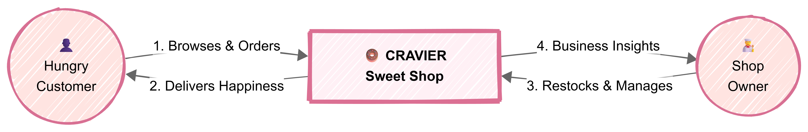
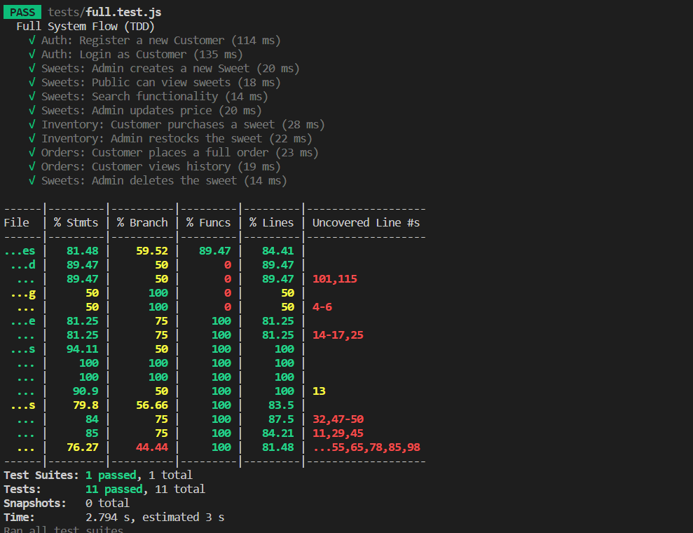
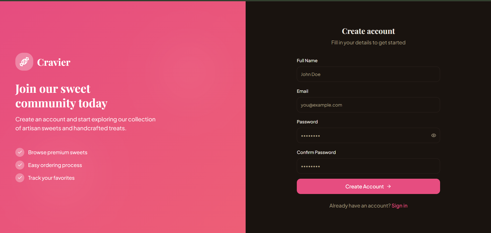
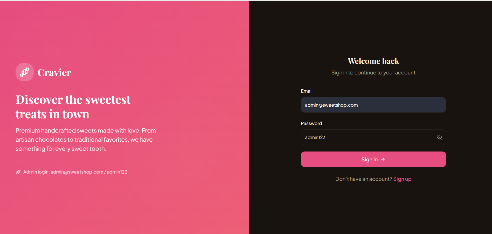
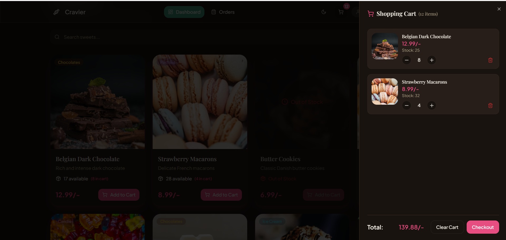
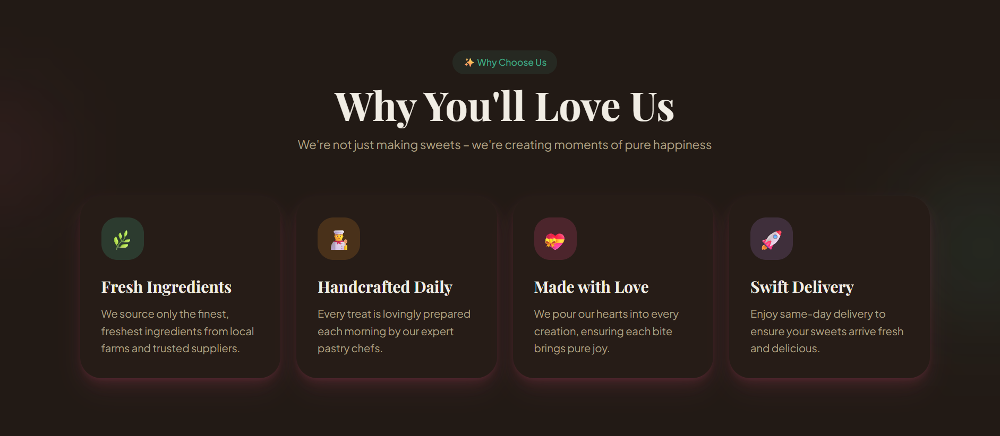
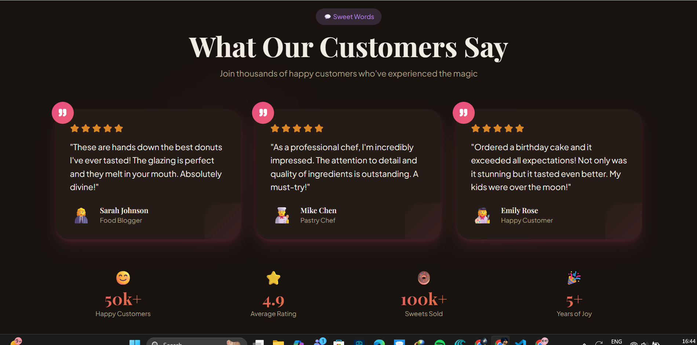
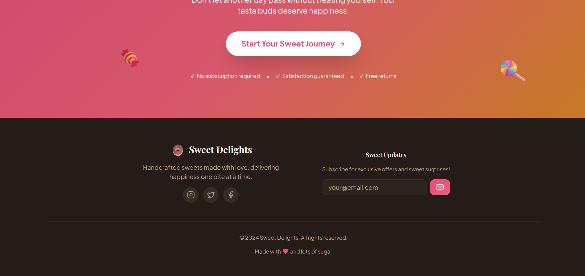

# Cravier (Sweet Shop Management System)

Cravier is a full-stack, single-page application (SPA) designed to modernize the traditional sweet shop experience. It features a seamless customer ordering flow, real-time inventory management for owners, and a robust REST API backend, fully deployed for production using Vercel and Render.


---


### Homepage


*(Note: The above image represents the actual Landing Page of the deployed application)*

### Design concept



---

## 🛠️ Tech Stack

**Frontend:**
* **Framework:** React (Vite)
* **Language:** TypeScript
* **Styling:** Tailwind CSS
* **Icons:** Lucide React
* **State Management:** React Context API

**Backend:**
* **Runtime:** Node.js & Express.js
* **Database:** MongoDB (Mongoose ODM)
* **Authentication:** JWT (JSON Web Tokens)
* **Testing:** Jest & Supertest

**Deployment:**
* **Frontend:** Vercel
* **Backend:** Render


---

<div align="center">

  ## 🌐 Live Deployment
  
  <a href="https://cravier-sweet-shop-management-system.vercel.app/">
    
  </a>

  <br/><br/>
  
  > ⚠️ **Warning:** This is a live production build. Do not click unless you have snacks nearby. The visuals are known to induce donuts craving.
  
</div>

---

## 🤖 My AI Usage

* **ChatGpt 5:** Used for System Architecture planning.
* **Gemini CLI:** Gemini CLI for Bug fixes.
* **Lovable** to get Frontend design Motivation.

---

## 🧪 Test Report & TDD Process

The backend follows a strict **Test-Driven Development (TDD)** approach.



* **Run Tests:** `npm test` (in backend directory)
* **Coverage Areas:** User Auth, Sweet CRUD operations, Inventory transactions.
* **test-report.html** is the test report in the repo
* **Status:** ✅ 100% Pass Rate (11/11 Tests Passed).
  
---

## 🔐 Credentials (Local Demo)

Since this is a portfolio project, the database is pre-seeded with these accounts:

| Role | Email | Password | Access |
| :--- | :--- | :--- | :--- |
| **Admin** | `admin@sweetshop.com` | `admin123` | Full Access (Inventory, Restock) |


---

## 📑 Table of Contents
1.  [Getting Started](#-getting-started)
2.  [Project Structure](#-project-structure)
3.  [API Documentation](#-api-documentation)
4.  [User Interface Flow](#-user-interface-flow)
5.  [Key Features](#-key-features)

---

## 🚀 Getting Started

Follow these instructions to set up the project locally.

### Prerequisites
* [Node.js](https://nodejs.org/) (v14+ recommended)
* [MongoDB](https://www.mongodb.com/) (Local service or Atlas URI)

### Installation

1.  **Clone the repository:**
    ```bash
    git clone [https://github.com/YOUR_USERNAME/cravier-sweet-shop.git](https://github.com/YOUR_USERNAME/cravier-sweet-shop.git)
    cd cravier-sweet-shop
    ```

2.  **Install Frontend Dependencies:**
    ```bash
    npm install
    ```

3.  **Setup Backend:**
    ```bash
    cd backend
    npm install
    ```

4.  **Environment Setup:**
    Create a `.env` file in the `backend/` folder:
    ```env
    PORT=5000
    MONGO_URI=mongodb://127.0.0.1:27017/sweetshop
    JWT_SECRET=cravier_secret_key_2024
    ```

5.  **Seed the Database:**
    Populate the DB with initial products and the admin user.
    ```bash
    # Inside backend folder
    node seed.js
    ```

### Running the Application

You need two terminal windows open:

**Terminal 1 (Backend):**
```bash
cd backend
npm start
# Server running on port 5000...
```

**Terminal 2 (Frontend):**

```bash
# Root folder
npm run dev
# Local: http://localhost:5173...
```


## 📂 Project Structure

```text
├── src/
│   ├── components/    # Reusable UI (Navbar, Cart, SweetCard)
│   ├── context/       # Global State (Auth, Cart, Order)
│   ├── pages/         # Route Views (Dashboard, Login, AdminPanel)
│   ├── services/      # API Integration (Axios configuration)
│   └── types/         # TypeScript Interfaces
├── backend/
│   ├── config/        # Database Connection
│   ├── controllers/   # Logic for Routes
│   ├── models/        # Mongoose Schemas (User, Sweet, Order)
│   ├── routes/        # Express API Routes
│   └── tests/         # Jest Test Files (TDD)
└── public/            # Static Assets
```

## 📡 API Documentation

### Authentication
* `POST /api/auth/register` - Register a new customer.
* `POST /api/auth/login` - Login and receive JWT.

### Sweets (Public & Admin)
* `GET /api/sweets` - Get all sweets.
* `GET /api/sweets/search` - Filter by query, category, or price.
* `POST /api/sweets` - Create a new sweet (**Admin only**).
* `PUT /api/sweets/:id` - Update an existing sweet details (**Admin only**).
* `DELETE /api/sweets/:id` - Remove a sweet from inventory (**Admin only**).

### Inventory (Transactions)
* `POST /api/sweets/:id/purchase` - Decrease stock by 1 (Customer).
* `POST /api/sweets/:id/restock` - Increase stock (**Admin only**).

### Orders
* `GET /api/orders` - View order history.
* `POST /api/orders` - Submit a cart checkout.

---

## 📱 User Interface Flow

1.  **Landing Page:**
    * Welcomes users with a responsive hero section.
    * Calls to action for "Get Started" or "Sign In".

2.  **Dashboard (Shop):**
    * **Search & Filter:** Real-time filtering by category (e.g., Chocolates, Cakes).
    * **Live Inventory:** Product cards show "Out of Stock" or "Low Stock" warnings based on real backend data.

3.  **Cart & Checkout:**
    * Slide-out cart drawer for easy access.
    * **Checkout Logic:** Validates stock levels one last time before confirming purchase.

4.  **Admin Panel:**
    * **Exclusive Access:** Protected route only for users with `role: admin`.
    * **Quick Actions:** Restock items or delete obsolete products with one click.

---

## 📸 Screenshots

### Dashboard


---

### Admin Panel


---

### SignUp



---

### LogIn


---

### Shopping Cart



---

### Order History


---

### Restock Form


---

### Landing Page Screenshots

> 


> 


> 


> 

---

### Footer



